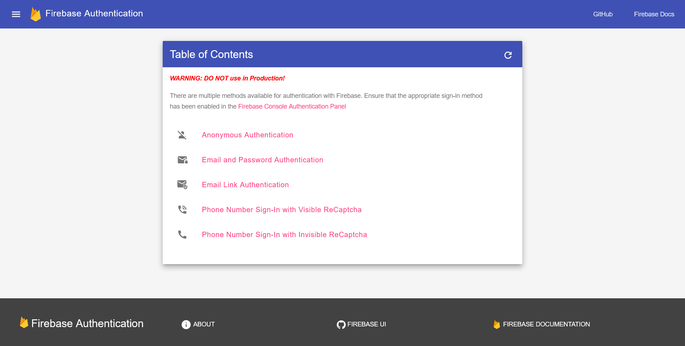
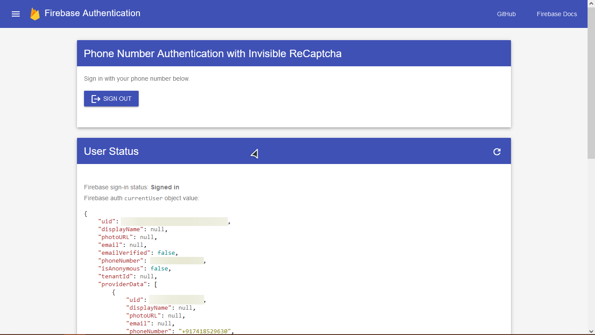
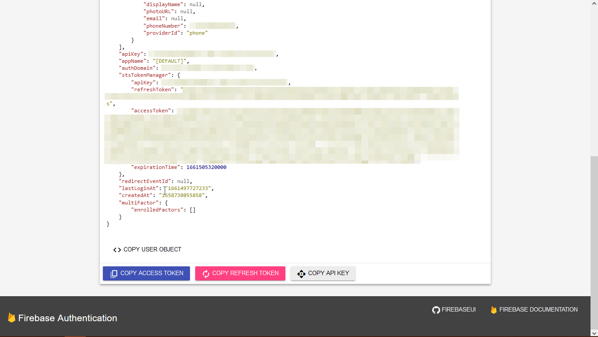

# DRF Firebase Auth

A Django REST Wrapper for Firebase Authentication with DRF.


## Snapshots

<p align="center" width="100%">
	
	<b>Firebase Authentication Home Page</b>
</p>

<p align="center" width="100%">
	
	<b>Phone Number Authentication - 1</b>
</p>

<p align="center" width="100%">
	
	<b>Phone Number Authentication - 2</b>
</p>

## 🎉 Features

- ✨Frontend built using [Material Design Lite](https://getmdl.io)
- ⭐Easily Integrates with Django and Django REST Framework (DRF)
- 🔥 Firebase Authentication included
- 📲 Supports Phone Number Authentication (Visible/Invisble reCaptcha)
- 📧Supports Email Link & Email + Password Authentication


## 🗺️ Roadmap

- 🌈Customizable [color scheme](https://getmdl.io/customize/index.html)
- 🕸 Support for WebSocket Authentication with Firebase for [channels](https://channels.readthedocs.io/en/stable/)


## Dependencies

[Python](https://python.org) >= 3.8

[Django](https://github.com/django/django) >= 3.9

[Django REST Framework](https://django-rest-framework.org)

[Firebase Admin Python SDK](https://github.com/firebase/firebase-admin-python)


## ⚙️ Installation

### Git
`git clone https://github.com/wh0th3h3llam1/drf-firebase-auth.git`


## 🛠️ Firebase Authentication Setup

### settings.py
Add the `FirebaseAuthentication` class to `DEFAULT_AUTHENTICATION_CLASSES`

```python
REST_FRAMEWORK = {
    "DEFAULT_AUTHENTICATION_CLASSES": (
        "drf_firebase_auth.authentication.FirebaseAuthentication",
        "rest_framework.authentication.TokenAuthentication",
        ...
    )
    ...
}
```

### models.py

Inherit your default `User` model from `AbstractFirebaseUser`

```python
class User(AbstractFirebaseUser, PermissionsMixin):
    profile_image = models.ImageField(
        upload_to="user/profile_images",
        blank=True, null=True
    )
    ...
```

The `AbstractFirebaseUser` model provided is designed to be compatible with Phone Number Authentication so `phone_number` is a "required and unique" field.

In case it's not required, you can edit the abstract model as per your requirements

### urls.py

```python
urlpatterns = [
    ...
    path("firebase/", include("drf_firebase_auth.urls")),
    ...
]
```

## ℹ️ Usage

### ⚠️ WARNING: DO NOT use in Production!

- Navigate to [http://127.0.0.1:8000/firebase](http://127.0.0.1:8000/firebase)


## 🤝 Contributing

Got any issues or suggestions?

Open a [Issue](https://github.com/wh0th3h3llam1/drf-firebase-auth/issues/)

## 📜 Licence

MIT
